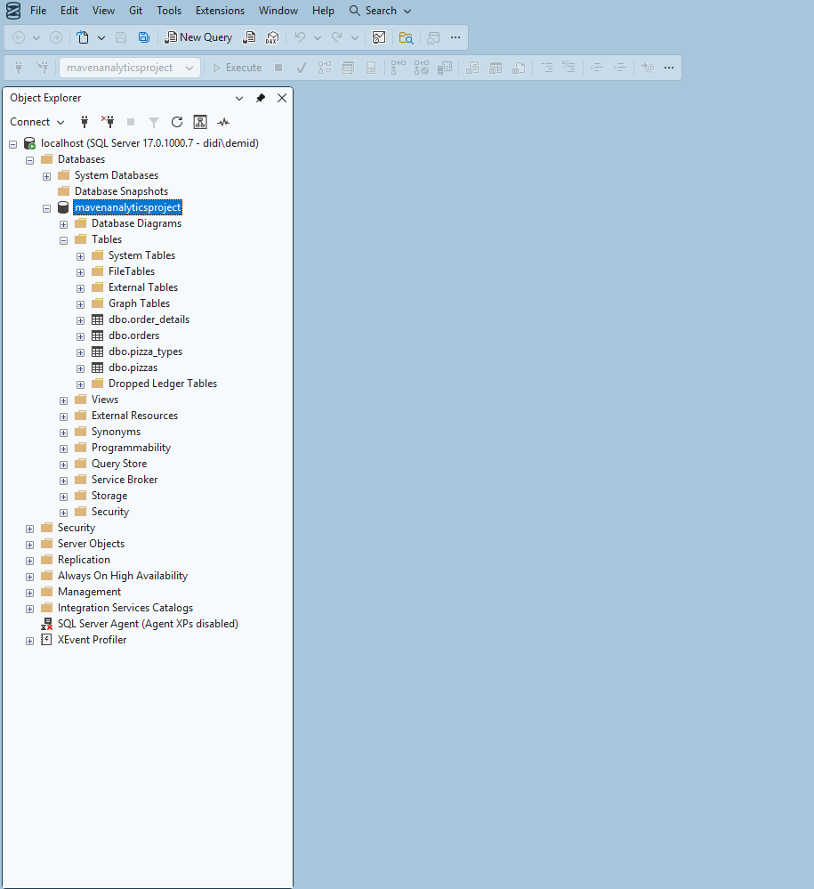
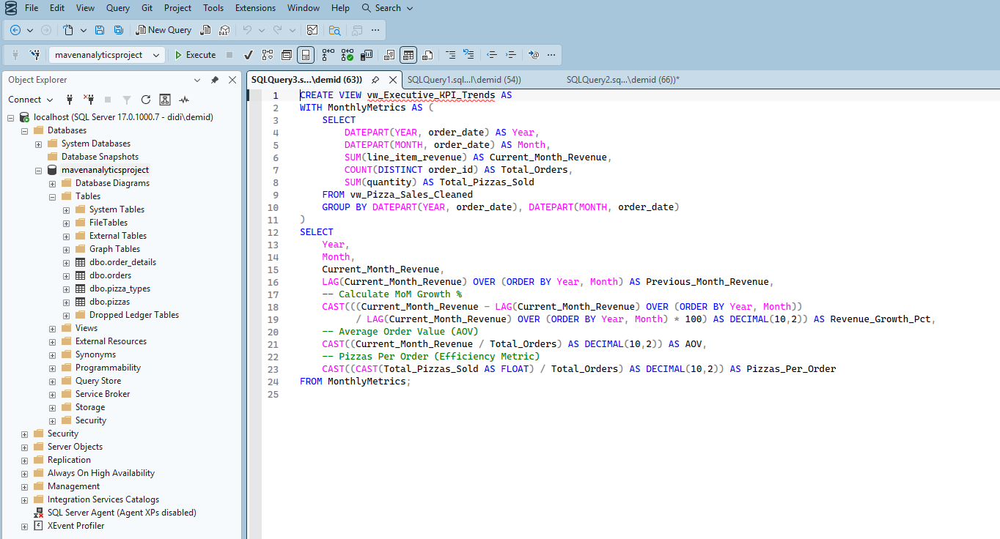
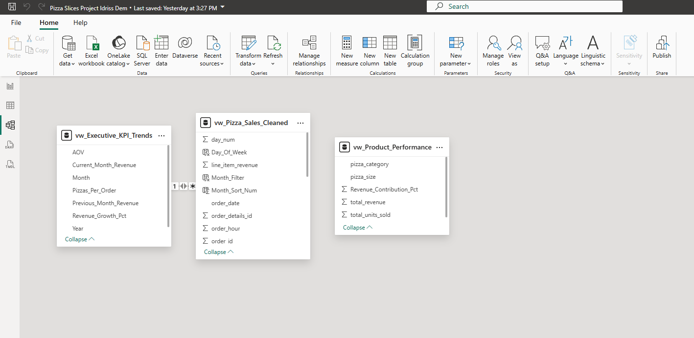
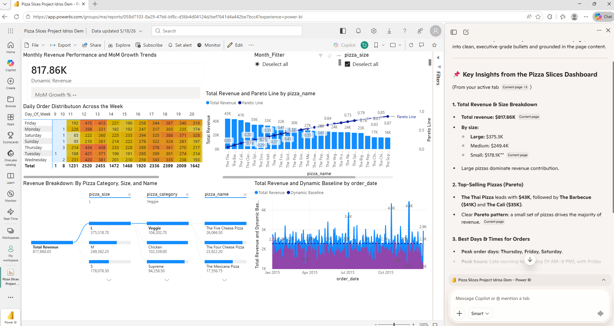

# Pizza-Slice-Power-BI
End-to-end relational SQL database and Power BI dashboard optimized with Microsoft Edge AI Copilot for automated visual commentary
# 🍕 Maven Pizza Place Sales: End-to-End Analytics & AI-Augmented BI Stack

## 🚀 Project Overview
This project delivers a complete, production-grade Business Intelligence solution mapping the **Maven Analytics Pizza Place Sales** dataset. The architecture spans local relational database configuration inside SSMS, SQL query automation, advanced DAX data modeling, and a cloud-published executive dashboard. 

To overcome the enterprise licensing barriers associated with embedded canvas chatbots, this portfolio project leverages a zero-cost, side-by-side AI operations companion via the **Microsoft Edge AI Ecosystem**.

---

## 🛠️ The Technical Stack & Architecture
- **Database Engine:** Microsoft SQL Server Management Studio (SSMS)
- **BI & Visualizations:** Power BI Desktop & Power BI Cloud Service
- **AI Analytics Engine:** Microsoft Edge Copilot (Generative AI Sidebar)

---

## 🗺️ Step-by-Step Implementation Pipeline

### 1. Database Infrastructure & SQL Automation
- Downloaded and mapped the relational pizza schema across 4 core tables: `orders`, `order_details`, `pizzas`, and `pizza_types`.
- Configured a local database instance within **SSMS**.
- Developed a suite of optimized T-SQL queries to automate data aggregation, uncovering foundational performance metrics.

#### 🖥️ SSMS Architecture Validation

---

### 2. Analytical Data Modeling (DAX)
- Imported clean data layers into **Power BI Desktop**.
- Engineered custom **DAX measures** to calculate dynamic, time-intelligent KPIs including total revenue, order frequency distributions, and category-level profit margins.

#### 📊 Power BI Desktop Modeling Environment

---

### 3. Cloud Deployment & The "Edge AI" Architecture Strategy
- Published the final interactive report seamlessly to the **Power BI Cloud Web Service**.
- **The Challenge:** Free/Pro Power BI accounts block native embedded canvas chatbots (like Power BI Copilot) behind premium organizational tiers. 
- **The Solution:** By opening the dashboard via the **Microsoft Edge browser**, the native browser AI sidebar can securely scan the active workspace layout, read the pizza charts, and provide live, automated operational commentary completely free of charge.

#### 🤖 Live AI Sidebar Interface

---

## 📈 Key Business Insights Discovered by the Stack
- **Financial Baseline:** Generated $817.8K in total sales across 49.5K pizzas (21.3K unique orders).
- **Bottleneck Patterns:** Identified severe kitchen and operational volume bottlenecks during lunch (12:00 PM – 1:00 PM) and dinner (5:00 PM – 6:00 PM).
- **Product Portfolio Optimization:** The *Classic* category leads the restaurant in pure unit volume, but the *Supreme* category dominates total dollar profitability. The *Brie Carre* was flagged as the lowest-performing menu item.

